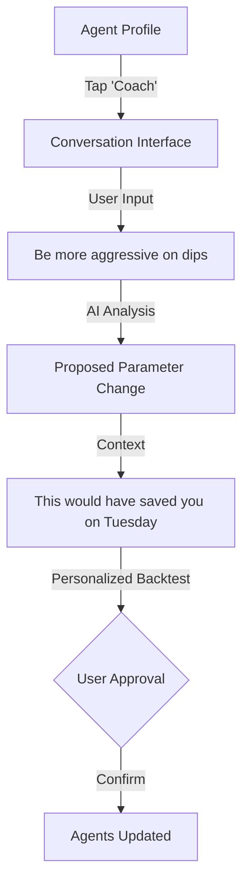

---
stepsCompleted:
  - 1
  - 2
  - 3
  - 4
  - 5
  - 6
  - 7
  - 8
  - 9
  - 10
  - 11
  - 12
  - 13
  - 14
inputDocuments:
  - product-brief-trade-2026-02-18.md
  - prd.md
---

# UX Design Specification trade

**Author:** team mantis a
**Date:** 2026-02-18

---

<!-- UX design content will be appended sequentially through collaborative workflow steps -->

## Executive Summary

### Project Vision

AI Trading Debate Lab externalizes trading reasoning into a transparent, live debate between opposing AI agents (Bull vs. Bear), moderated by a helping Risk Guardian. It solves "analysis paralysis" by helping users understand the *why* behind a trade, offering "Cognitive Offloading" rather than black-box signals.

### Target Users

- **Miguel (Beginner):** Learner who fears losing money. Needs the Risk Guardian's protection and plain-language explanations.
- **Diana (Intermediate):** Trader who wants to validate her strategies. Needs **coaching** tools to tune agents to her rules, rather than just "teaching" them. She wants to be in the driver's seat.
- **Prof. Reyes (Educator):** Teacher who needs replay/pause tools to demonstrate market logic to students.

### Key Design Challenges

- **Cognitive Load:** Balancing the density of a 3-way debate with readability and "at-a-glance" comprehension.
- **The "Risk" Intervention:** Designing the Risk Guardian's interjections to stop the flow effectively when danger is detected.
- **Perceived Latency:** Turning API latency into a feature ("Agents are thinking...") to build anticipation.
- **Regulatory Safety:** Ensuring UI elements (confidence scores, recommendations) never look like guaranteed financial advice.
- **Mobile-First:** Ensuring the debate view works flawlessly in portrait mode for on-the-go users like Miguel.

### Design Opportunities

- **The "Traffic Light" Metaphor:** A universal, instant-read UI for confidence and risk.
- **Dramatized Debates:** Using chat UI patterns (typing indicators, abrupt stops) to make the debate feel like a live event.
- **Visceral Confidence:** Using micro-animations and dynamic UI (e.g., trembling bars) to make the data "sweat" and turn latency into anticipation.

## Core User Experience

### Defining Experience

The core experience is **"Cognitive Offloading via Dramatized Reasoning."** The user triggers a debate and watches it unfold like a live event. The key isn't just the result, but the *feeling* of having two experts argue the case for you.

### Platform Strategy

- **Mobile-First Web:** The interface must be optimized for vertical scrolling and thumb-based interaction (Portrait Mode).
- **Thumb Zone:** All primary actions (Vote, Config) must be easily accessible at the bottom 30% of the screen.

### Effortless Interactions

- **Instant Verdicts:** "Traffic Light" system replaces complex probability scores for at-a-glance decision making.
- **Ambient Sentiment:** The "Traffic Light" isn't just a badge; it's an ambient UI effect (glows/tints) that colors the environment based on the winning argument.
- **Persona Templates:** Pre-bundled logic sets for "Coaching" (e.g., "Clone the Bull's Logic but make it tighter") to solve the blank slate problem for users like Diana.

### Critical Success Moments

- **The Guardian Intervention:** A visual and haptic "Stop" moment when high risk is detected. The UI must demand attention here.
- **The "Discipline Win":** Explicitly rewarding the user for *not* trading when the setup is bad—gamifying patience with a "Discipline Score" or "Patience Streak."

### Experience Principles

1.  **Latency is Drama:** Use processing time to build anticipation (typing indicators, "thinking" states, trembling bars).
2.  **Safety is Loud:** Risk warnings must be the most visually distinct element in the UI.
3.  **Coach, Don't Code:** Customization should feel like management, not engineering.
4.  **The UI is the Sentiment:** Don't just show a number; tint the world.

## Desired Emotional Response

### Primary Emotional Goals

- **Structured Relief:** The primary feeling is the removal of anxiety. The user offloads the "processing" to the agents.
- **Empowered Clarity:** Users shouldn't feel *told* what to do; they should feel they *understand* what to do (Competence).
- **Safe Thrill:** The debate provides the excitement of the market (Danger) without the immediate panic of capital risk (Safety).

### Emotional Journey Mapping

- **Input:** *Anxious Curiosity* ("What am I missing?")
- **Process:** *Gripped Anticipation* (Watching the sharp, aggressive tug-of-war between Bull/Bear).
- **Output:** *Confident Resolve* (Actionable clarity).
- **Outcome:** *Validated Gratitude* ("Glad I didn't buy that top. We dodged a bullet.").

### Micro-Emotions

- **JOMO (Joy Of Missing Out):** Specifically designing for the "Wait" verdict to feel like a victory.
- **Gratitude:** Using a **"Shield" metaphor** (visual animation) to make protection feel active, not passive.
- **Belonging:** The presence of the Team ("We think...") creates a feeling of having a co-pilot, curing isolation.

### Emotional Design Principles

- **Calm in the Storm:** The Risk Guardian uses round, smooth, cool UI (Blues/Purples) to contrast with the sharp, aggressive, hot UI of the Bull/Bear.
- **Celebrate Discipline:** Visually reward patience as much as profit (e.g., "Shield" animation).
- **Hero Narrative:** Frame the user's decision (even to do nothing) as an act of competence/wisdom.

## UX Pattern Analysis & Inspiration

### Inspiring Products Analysis

- **Duolingo:** Masterclass in gamifying "doing the right thing" daily. We will borrow their "Streak" mechanics for our "Discipline Score."
- **Robinhood:** Proved that trading UI can be minimal. We will adopt their clean typography and "Thumb Zone" actions but reject their "confetti for everything" ethos.
- **DraftKings (Live Betting):** Best-in-class for visualizing real-time conflict. We will adapt their "Momentum Visuals" for the AI Debate.

### Transferable UX Patterns

- **Tug-of-War Bar:** A live, oscillating bar showing which agent (Bull/Bear) currently has the upper hand in the argument.
- **The "Streak" Shield:** A visual indicator that grows stronger the longer the user avoids bad trades (Wait Verdicts).
- **The Explainable Chip:** Tapping any complex term instantly opens a "Explain like I'm 5" card (common in educational apps).

### Anti-Patterns to Avoid

- **Data Overload:** No walls of text or complex charts in the primary view.
- **Dark Pattern Gamification:** Avoiding "FOMO" triggers (e.g., "Time is running out to buy!").
- **The "Guru" Aesthetics:** Avoiding the gold/black "Luxury" aesthetic of scammy signal groups. We want "Scientific/Clean" (White/Blue/Teal).

### Design Inspiration Strategy

- **Adopt:** Duolingo's "Streak" visuals for the Risk Guardian's patience rewards.
- **Adapt:** Sportsbetting's "Live Momentum" visualizations for the core Debate animation.
- **Avoid:** Any UI pattern that encourages impulsive clicking (like "One-Tap Buy" without confirmation).

## Design System Foundation

### 1.1 Design System Choice

**Shadcn/ui (Radix UI + Tailwind CSS) + Framer Motion.**

### Rationale for Selection

- **Scientific Aesthetic:** Shadcn/ui's default typography (can be swapped for Geist Sans) and spacing scale lean towards the clean, information-dense look we want.
- **Mobile First:** Utility classes make it trivial to fine-tune the "Thumb Zone" and portrait layouts without fighting framework overrides.
- **Unconstrained Creativity:** Radix Primitives handle accessibility for complex interactions (Debate Stream, Verdict) without imposing visual styles, while Framer Motion enables the "Visceral Confidence" animations that CSS alone cannot handle.

### Implementation Approach

- **Component Base:** Shadcn/ui for standard app shells (Layouts, Forms, Settings).
- **Interactive Primitives:** Radix UI for custom widgets (The Tug-of-War Bar, The Shield).
- **Animation:** Framer Motion for all micro-interactions and "living data" visualizations.
- **Icons:** Lucide React (crisp, professional line icons).

### Customization Strategy

- **Typography:** **Geist Sans** (Headers/Data) + **Inter** (Body) to nail the "Scientific/Futuristic" vibe.
- **Color Palette:**
    - **Neutral:** Slate (Cool greys for a tech feel).
    - **Semantics:** Custom `Signal Green`, `Danger Red`, and `Guardian Purple` (no generic primary blue).
- **Border Radius:** Tight (sm/md) to reinforce the "Professional Tool" feel, contrasting with the Risk Guardian's rounder shield.

## Core User Experience (Refined)

### 2.1 Defining Experience

**"The Active Watch" (Dramatized Reasoning).** The user selects an asset and spectates a live, fast-paced debate between AI agents. They are not an analyst; they are the **Jury** in a TV Court Drama.

### 2.2 User Mental Model

- **Shift:** From "I must solve the puzzle" to "I judge the argument."
- **Metaphor:** The Courtroom. The Bull and Bear are aggressive **Gladiators** fighting for the user's vote. The Risk Guardian is the **Judge** who maintains order and instructions the Jury. The User is the **Jury** who delivers the final verdict.

### 2.3 Success Criteria

- **Clarity:** Can the user explain the *risk* to a friend in 1 sentence after 30 seconds?
- **Engagement:** Retention > 80% on the debate duration (Entertainment value).
- **Validation:** Does the "Wait" verdict feel like a "Smart Decision" (Discipline Score), not a missed opportunity?

### 2.4 Novel UX Patterns

- **The Debate Stream:** A specialized chat UI where non-human agents argue. Uses "Typing Awareness" to simulate thought speed.
- **The Living Sentiment:** The entire UI container (borders, backgrounds) acts as a live "Mood Ring" reflecting the debate's current winner (Red/Green/Purple).
- **The Freeze Transition:** A stark visual stop (motion freeze) when the Risk Guardian enters to demand meaningful attention.

### 2.5 Experience Mechanics

1.  **Trigger:** Tap Asset Card.
2.  **Action:** Watch 15-30s Debate animation (text + chart highlights).
3.  **Climax:** Risk Guardian Interrupt (Screen Shake/Haptic + Freeze).
4.  **Resolution:** **"Seal the Verdict"**: The Guardian explicitly guides the user ("I recommend WAIT"), and the user confirmed the decision to update their Discipline Score.

## Visual Design Foundation

### Color System

- **Neutrals:** `Slate` (050-950). Cool, technical background.
- **Semantic Colors:**
    - **Bull Agent:** `Emerald-500` (Optimization/Profit) - Sharp, vibrant.
    - **Bear Agent:** `Rose-500` / `Orange-500` (Risk/Loss) - Warm, distinct from alarm red.
    - **Risk Guardian:** `Violet-600` (Authority/Protection) + **Frosted Glass** (`backdrop-blur-md`).
    - **Danger/Alarm:** Bright Red, reserved *only* for "Stop Trading" warnings.
- **Ambient Logic:** The UI background tints faintly (5% opacity) to match the winning agent (`Emerald-50/Rose-50`).

### Typography System

- **Primary (Headings/Data):** **Geist Sans**.
    - Rationale: Mono-like precision for numbers, widely spaced characters for legibility.
- **Secondary (Body/Chat):** **Inter**.
    - Rationale: Neutral, invisible typeface for long reading.
- **Verdict Weight:** **Black/Heavy** weights for the final Verdict to give it visual authority ("Gavel Drop").
- **Readability Floor:** **16px minimum** for all Debate Stream text (no tiny fonts for mobile users).

### Spacing & Layout Foundation

- **Base Unit:** 4px (`rem` based).
- **Container Style:** "Card-based Cockpit". Everything lives in clearly defined, bordered cards (`bg-white border-slate-200`).
- **Radius:** `rounded-lg` (8px) for containers, `rounded-sm` (4px) for buttons/tags. Harder edges = more serious tool.
- **Density:** Compact margins/padding, but *large* text size. High information density without squinting.

### Accessibility Considerations

- **Color Blindness:** The "Traffic Light" (Red/Green) must always be accompanied by Icons (Up/Down Arrows) and Text Labels.
- **Contrast:** All text must pass WCAG AA on the `Slate-50` background.

## Design Direction Decision

### Design Directions Explored

- **The Cockpit:** High density, bordered cards, "Bloomberg" feel. Good for pros, but cluttered.
- **The Focus:** Minimalist, whitespace-heavy. Good for clarity, maybe too simple for "AI Intelligence."
- **The Glasshouse:** Dark mode, frosted glass, glowing accents. Very "Futuristic/AI."
- **The Terminal:** Retro-hacker. Too niche.

### Chosen Direction

**"The Glass Cockpit" (Hybrid).**

### Design Rationale

- **Aesthetic (Glasshouse):** We need to sell the *Intelligence* of the system. Dark mode with frosted glass overlays (`backdrop-blur`) and glowing accents (Emerald/Rose) creates a "Premium/Tony Stark" vibe that flat white UIs cannot match.
- **Structure (Cockpit):** However, to satisfy the user's need to feel like a "Pro Trader" (Complexity Theatre), we will enforce the **High Density** layout of the Cockpit. We will use subtle borders (`border-white/10`) to contain data, ensuring it doesn't just float in space.
- **The Best of Both:** It looks like the Future, but organizes data like a Tool.

### Implementation Approach

- **Theme:** Dark Mode Default (`Slate-900` bg).
- **Glass Effects:** The Risk Guardian and Sticky Headers/Navs will use `bg-slate-900/80 backdrop-blur-md`.
- **Borders:** Subtle `border-white/10` to define card edges without heavy lines.
- **Glows:** `shadow-emerald-500/20` for winning arguments to created "Ambient Sentiment."

## User Journey Flows

### Journey 1: The Active Watch (Core Loop)
**Goal:** User consumes a dramatic debate and makes a decision with low cognitive load.

```mermaid
graph TD
    A[Home Feed] -->|Tap Asset Card| B(The Arena Opens)
    B --> C{Debate Stream}
    C -->|Bull Argument| D1[Green Glow]
    C -->|Bear Argument| D2[Red Glow]
    C -->|Risk Detected| E[Guardian Interrupt]
    E -->|Vibration + Freeze| F[Suspense Build-Up (1.5s)]
    F --> G[Verdict Reveal]
    G -->|Risk Analysis| H{User Decision}
    H -->|Seal Verdict: Agree| I[Discipline Score +10]
    H -->|Seal Verdict: Disagree| J[Discipline Score +0]
    I --> K[One-Tap Trade (Optional)]
```

### Journey 2: Onboarding ("The First Trial")
**Goal:** Prove safety ("Risk Avoidance") before deposit.

```mermaid
graph TD
    A[Welcome] -->|Select Persona| B(Risk Tolerance Quiz)
    B --> C[Meet Your Guardian]
    C -->|Simulated Debate| D[First Verdict]
    D -->|User Votes| E[Outcome Reveal]
    E -->|"You avoided High Risk!"| F[Trust Established]
    F --> G[Activate Shield (Connect Exchange)]
```
*Refinement:* "Connect Exchange" is framed as "Activating Shield" to reduce friction.

### Journey 3: Strategy Coaching (Configuration)
**Goal:** Diana tunes agents with natural language & verification.



### Flow Optimization Principles
1.  **The "Weighty" Reveal:** In Journey 1, the Verdict doesn't pop instantly. A 1.5s animation builds authority and forces attention.
2.  **Simulation First:** In Journey 2 & 3, show "What If" scenarios (Personalized Backtest) before committing to changes.
3.  **Trust Framing:** Always frame success as "Risk Avoided" or "Bad Trade Skipped," never as "Guaranteed Profit."

## Component Strategy

### Design System Components (Shadcn/ui)
We will leverage these existing components to move fast (wrapped in a `ui/` facade):
-   **Dialog:** For the "Guardian Overlay" container.
-   **Card:** Base style for dashboards.
-   **Badge:** For sentiment indicators.
-   **ScrollArea:** For the debate list (must be virtualized).

### Custom Components ("Crown Jewels")

#### 1. DebateStream
-   **Purpose:** The core consumption experience.
-   **Anatomy:** A list of `ArgumentBubble` components.
-   **Technical Requirement:** **Virtualization** (e.g., `tanstack/react-virtual`) is mandatory to handle infinite scrolling without performance degradation.
-   **Interaction:** Auto-scrolls on new message. User scroll pauses the stream.
-   **Animation:** Messages slide up (`y: 20 -> 0`). Typographic "decoding" effect for AI text generation.

#### 2. VerdictOverlay
-   **Purpose:** The climax of the loop.
-   **States:** `Hidden`, `Interrupt` (Background blurs, UI freezes), `Revealed` (Card slams in).
-   **Animation:** Use **CSS + Framer Motion** initially. Upgrade to Rive only if "Game-Feel" is insufficient.
-   **Haptics:** Strong impact vibration on `Revealed` state.

#### 3. AssetCockpitCard
-   **Purpose:** The "Professional" data layer.
-   **Visuals:** High density, sparklines, subtle borders (`border-white/10`).

### Implementation Roadmap
1.  **Phase 1 (The Core Loop):** `DebateStream` (Virtual List), `VerdictOverlay`, `AssetCockpitCard`.
2.  **Phase 2 (Onboarding):** `RiskQuiz`, `PersonaSelector`.
3.  **Phase 3 (Optimization):** `BacktestVisualizer` (for Strategy Coaching).

## UX Consistency Patterns

### Feedback Patterns: "The Living UI"
-   **Ambient Sentiment:** The application background (`bg-slate-900`) subtly tints (`opacity-5`) to match the winning debate agent.
    -   *Bull Winning:* `bg-emerald-900/10`
    -   *Bear Winning:* `bg-rose-900/10`
    -   *Neutral/Wait:* `bg-slate-900`
    -   *Accessibility Rule:* This tint is purely decorative. A persistent **Status Icon** (e.g., "Bullish (+4)") must coexist in the header for colorblind users.
-   **Audio/Haptics:**
    -   *New Argument:* Light tick (Haptic).
    -   *Guardian Interrupt:* Heavy double-pulse (Heartbeat).

### Modal Patterns: "System Override"
-   **The Freeze:** The Risk Guardian is NOT a standard dialog.
    -   **Behavior:** Scroll locks.
    -   **Visuals:** Background desaturates to `grayscale(100%)` (The "Grey-Out") to force focus on the Guardian Card.
    -   **Exit:** Cannot be dismissed by tapping outside. Requires explicit choice ("I Agree" or "Ignore Risk").

### Navigation Patterns
-   **The Thumb Zone (Portrait Optimized):**
    -   **Primary Actions (Vote, Config):** Fixed at bottom 15vh.
    -   **Secondary (Chart Settings):** Top right (Reach Zone).
    -   **Card Swiping:** Swipe Left/Right on the *Chart Area* to change assets (TikTok-style ticker navigation).

### Empty States
-   **Debate Loading:** Never show a spinner. Show "Agents analyzing order book..." with a terminal-style typing effect to build anticipation.

## Responsive Design & Accessibility

### Responsive Strategy: "The Vertical Courtroom"
-   **Mobile-First (Principal):** The layout is optimized for **Portrait Mode** (Vertical Scrolling).
-   **Desktop Expansion:** On wide screens (>1024px), the UI expands into a 3-column dashboard:
    1.  **Watchlist (Left):** Quick asset switching.
    2.  **The Arena (Center):** The Debate Stream (Wider, more history visible).
    3.  **Deep Data (Right):** Technical indicators that are hidden on mobile.
-   **DOM Ordering:** The `DebateStream` (Center Col) must be strictly ordered *before* the side columns in the DOM to ensure screen readers prioritize the live argument.

### Breakpoint Strategy
-   **Mobile (< 768px):** Single Column. Navigation Bar at Bottom.
-   **Tablet (768px - 1024px):** Single Column with Sidebar Navigation.
-   **Desktop (> 1024px):** 3-Column Command Center (Masonry Layout).

### Accessibility Strategy (WCAG AA Strict)
-   **Dual-Coding for Color:**
    -   NEVER use color alone to convey status.
    -   *Example:* A "Bullish" signal is Green + `ArrowUp` Icon + Text "Bullish".
-   **Motion Safety:**
    -   All animations (Debate Slide-Ups, Verdict Slams) must respect `prefers-reduced-motion` media query.
-   **Zoom Safety:**
    -   All containers must use `rem` units to support **200% Browser Zoom** without clipping crucial UI (like the Guardian Overlay).
-   **Focus Traps:**
    -   The "Guardian Interrupt" modal must strictly trap keyboard focus, preventing users from tabbing behind the warning.
-   **ARIA Live Regions:**
    -   The `DebateStream` container uses `role="log"` `aria-live="polite"` to announce new AI arguments without interrupting the user.

### Testing Strategy
-   **Real Device Lab:** Must test "Thumb Zone" reachability on iPhone Mini (Smallest) and Max (Largest).
-   **Color Blindness:** Verify all "Traffic Light" signals using Deuteranopia simulators.
-   **Screen Reader:** Verify `DebateStream` announcements on VoiceOver (iOS) and NVDA (Windows).


